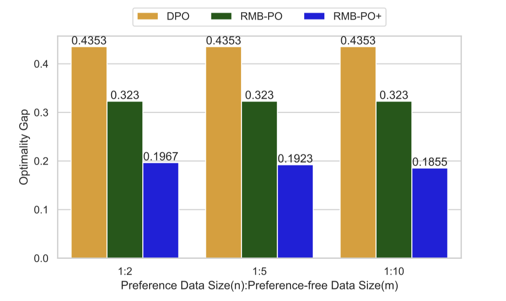

# Policy Optimization in RLHF: The Impact of Out-of-preference Data


This repository contains the code to reproduce experiments in the [paper](https://arxiv.org/abs/2312.10584): Policy Optimization in RLHF: The Impact of Out-of-preference Data.

The experiments show that policy optimization with out-of-preference data is key to unlocking the reward model's generalization power.





##  How to use

### Prepare

The Python environment can be set up using Anaconda with the provided `environment.yml` file.

```
conda env create -f environment.yml
conda activate bandit
```

### Linear Bandit


```
bash scripts/run_linear_bandit.sh
```

### Neural Bandit


```
bash scripts/run_neural_bandit.sh
```

## Bibtex

If you find this code is helpful, please cite our paper in the following format.

```
@article{li2023policy,
  title     = {Policy Optimization in RLHF: The Impact of Out-of-preference Data},
  author    = {Li, Ziniu and Xu, Tian and Yu, Yang},
  journal   = {arXiv preprint arXiv:2312.10584},
  year      = {2023},
}
```

